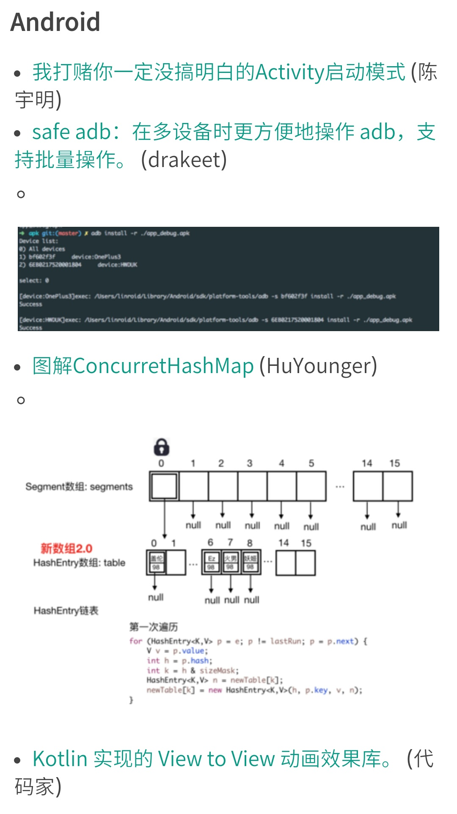
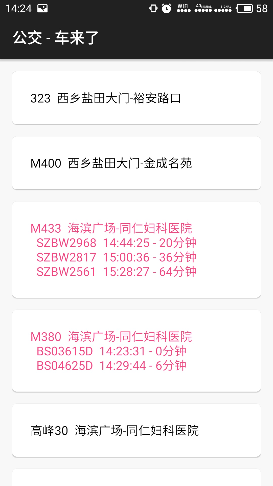
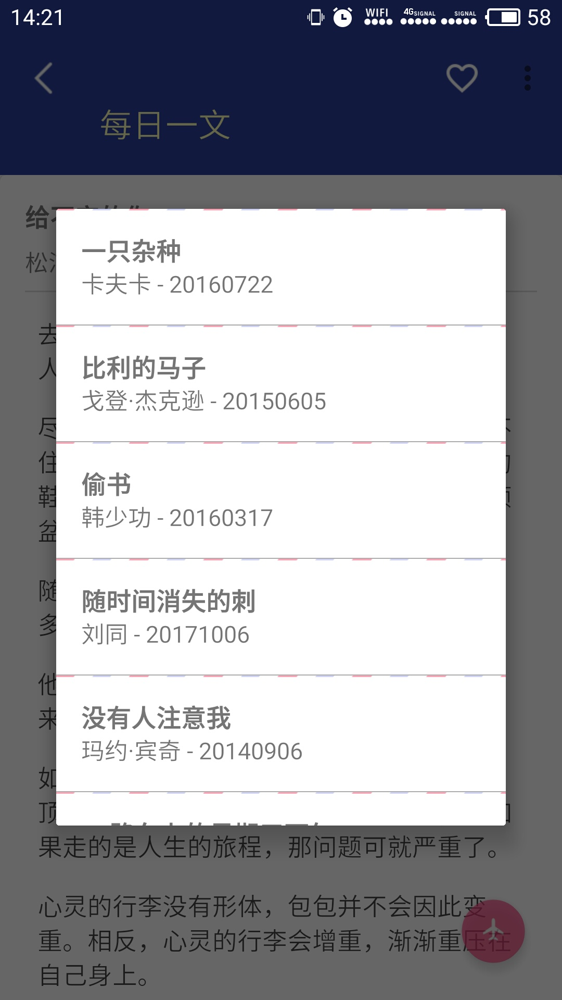
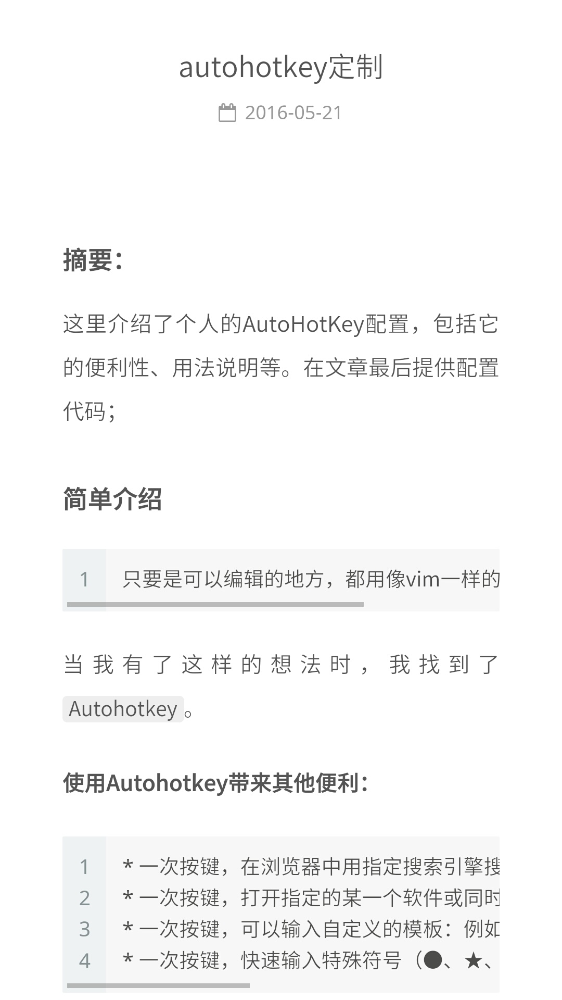

## `loulib` module
在项目中，重用又重用的部分，提取出来作为一个库来引用：
``` groove
compile 'com.lyloou:lou:1.0.4'
```


## `java` module
用来练习 java8、retrofit、rxjava的模块；


## `demo` module
用来练习 android 中的框架、好用的开源库；


## `smoothlayout` module
用来练习 android appbarlayout、coordinate、toolbar等布局的知识；


## `test` module
我经常用来学习和放松的一个app；
下载地址：https://play.google.com/store/apps/details?id=com.lyloou.test

<br/>


<br/>



<br/>


<br/>



<br/>


<br/>
