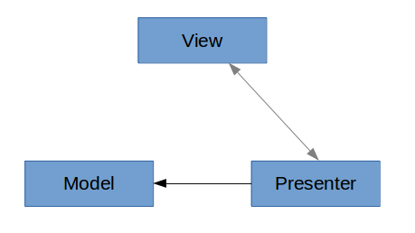
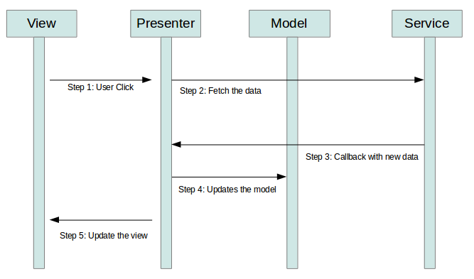

## 模型图

## 数据流向图 - The following demonstrates an example data flow throw the MVP.

## 参考资料
- [Android Architecture with MVP or MVVM - Tutorial](http://www.vogella.com/tutorials/AndroidArchitecture/article.html)
- [googlesamples/android-architecture](https://github.com/googlesamples/android-architecture/tree/todo-mvp)
- [Android官方MVP架构示例项目解析](http://www.infoq.com/cn/articles/android-official-mvp-architecture-sample-project-analysis)
- [浅谈 MVP in Android - Hongyang - 博客频道 - CSDN.NET](http://blog.csdn.net/lmj623565791/article/details/46596109)
