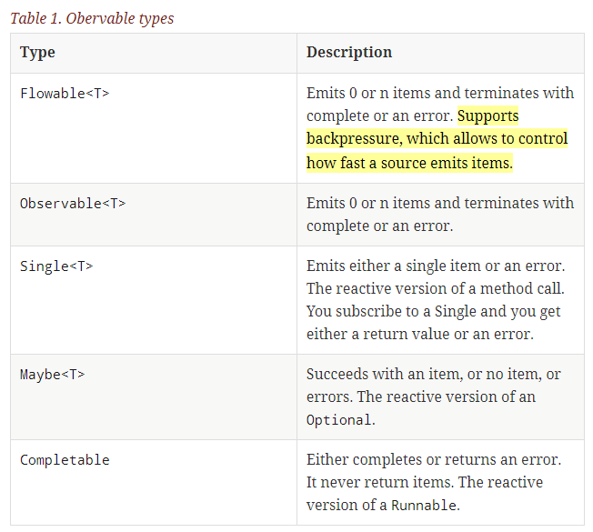
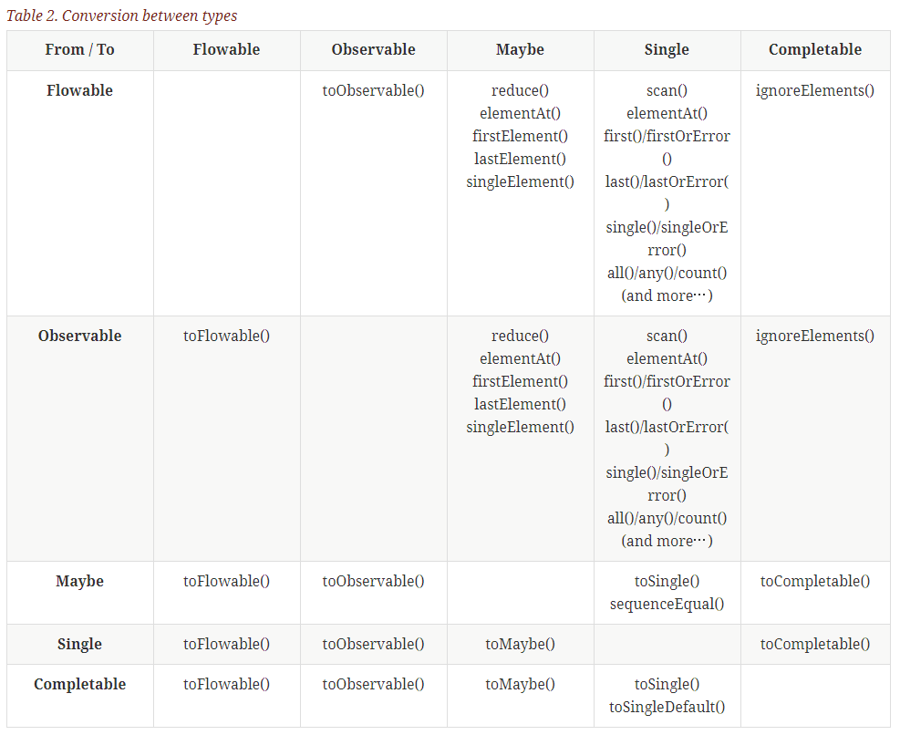

 # RxJava2 Exploring

[TOC]

  

- [RxJava 2.0 - Tutorial](http://www.vogella.com/tutorials/RxJava/article.html#using-reactive-programming-with-rxjava-2-0)
>
Backpressure
you can tell the source to emit the events on a slower rate in case you cannot processes them
at the rate the user produces them.

- [你真的会用RxJava么?RxJava线程变换之observeOn与subscribeOn - 简书](http://www.jianshu.com/p/59c3d6bb6a6b)
> observeOn作用于该操作符之后操作符直到出现新的observeOn操作符
> subscribeOn 作用于该操作符之前的 Observable 的创建操符作以及 doOnSubscribe 操作符 ，
  换句话说就是 doOnSubscribe 以及 Observable 的创建操作符总是被其之后最近的 subscribeOn 控制 。
> 博文中所谓的 之后、之前 不代表中间没有其它操作符。
> doOnSubscribe与onStart类似，均在代码调用时就会回调，但doOnSubscribe可以通过subscribeOn操作符改变运行的线程且越在后面运行越早。

- [Thomas Nield: RxJava- Understanding observeOn() and subscribeOn()](http://tomstechnicalblog.blogspot.ca/2016/02/rxjava-understanding-observeon-and.html)

